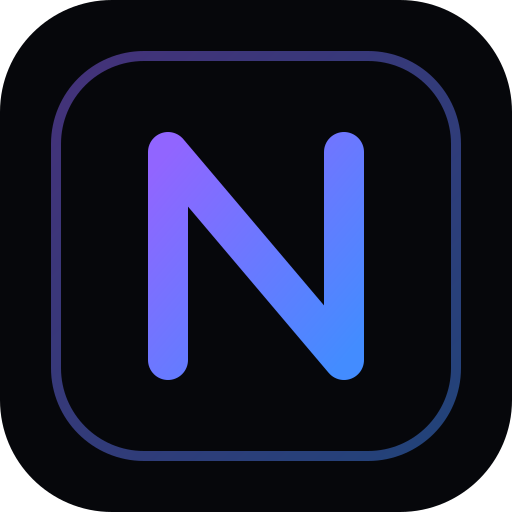
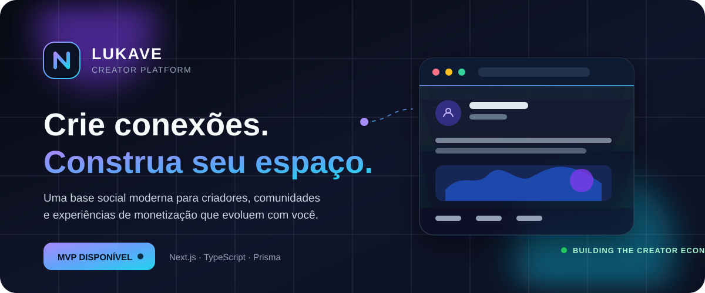

<div align="center">
  

  # Lukave

  ### Crie. Conecte. Evolua.

  **A plataforma social para criadores, comunidades e novas formas de monetização.**

  <p>
    <a href="#comece-em-minutos"><strong>Começar agora</strong></a>
    &nbsp;·&nbsp;
    <a href="./ARCHITECTURE.md">Arquitetura</a>
    &nbsp;·&nbsp;
    <a href="./ROADMAP.md">Roadmap</a>
    &nbsp;·&nbsp;
    <a href="./TODO.md">Backlog</a>
  </p>

  <p>
    
    
    
    
  </p>
</div>

<br />

<p align="center">
  
</p>

> [!NOTE]
> O SVG acima possui animações nativas. Caso o seu visualizador não as suporte, ele continua exibindo uma versão estática do conceito visual.

## O que é o Lukave?

O **Lukave** é uma plataforma web para pessoas que criam, compartilham e cultivam comunidades. Ele reúne identidade digital, publicação de conteúdo e interação social em uma experiência única — com uma arquitetura preparada para incorporar produtos, assinaturas e monetização de forma progressiva.

O produto está na **Fase 1 (MVP)**: uma fundação social completa, construída para ser rápida de evoluir e simples de operar.

<table>
  <tr>
    <td width="33%" valign="top">
      <h3>✦ Criação</h3>
      Publicações de texto e imagem, com uma experiência pensada para compartilhar ideias e construir presença.
    </td>
    <td width="33%" valign="top">
      <h3>◌ Conexão</h3>
      Perfis, seguidores, busca, comentários e notificações para aproximar criadores e audiência.
    </td>
    <td width="33%" valign="top">
      <h3>↗ Evolução</h3>
      Base preparada para comunidades, marketplace, assinaturas e novas experiências sociais.
    </td>
  </tr>
</table>

## Capacidades atuais

| Área | O que já está disponível |
| --- | --- |
| **Identidade** | Cadastro, login, troca e recuperação de senha, configurações de conta. |
| **Perfil** | Avatar, banner, bio, localização, website e links sociais. |
| **Conteúdo** | Feed com posts de texto/imagem, curtidas, comentários e compartilhamentos. |
| **Descoberta** | Busca por usuários e conteúdos, com abas e debounce. |
| **Relacionamentos** | Seguir/deixar de seguir e contadores de audiência. |
| **Engajamento** | Notificações de curtidas, comentários e novos seguidores. |

## Próxima evolução do produto

A fundação técnica já considera os próximos ciclos de crescimento:

```text
MVP Social  ──►  Conversas & Stories  ──►  Comunidades  ──►  Marketplace  ──►  Monetização
     ✓                  planejado             planejado          planejado          planejado
```

- **Social:** stories, mensagens privadas e recomendações de conteúdo.
- **Comunidades:** espaços públicos, privados e por assinatura, com moderação.
- **Marketplace:** produtos digitais, checkout e biblioteca de compras.
- **Monetização:** planos, gorjetas e programa de criadores.

Consulte o [roadmap completo](./ROADMAP.md) para as fases, prioridades e dívidas técnicas.

## Stack e arquitetura

<div align="center">

| Interface | Aplicação | Dados e serviços |
| :---: | :---: | :---: |
| React 19 · Tailwind CSS · Radix UI · Framer Motion | Next.js 15 · App Router · Server Actions · Zod | PostgreSQL · Prisma · Auth.js · Supabase · Stripe |

</div>

O Lukave adota um **monolito modular**: leituras usam React Server Components, mutações são realizadas por Server Actions tipadas e o Prisma centraliza o acesso ao PostgreSQL. Essa abordagem reduz a superfície operacional sem limitar a evolução do produto.

```text
Browser / PWA
      │
      ├── React Server Components  →  consultas
      └── Server Actions           →  mutações validadas
                                      │
                              Prisma ORM + PostgreSQL
                                      │
                     Auth.js · Supabase Storage · Stripe
```

Veja as decisões, estrutura de diretórios e práticas de segurança em [ARCHITECTURE.md](./ARCHITECTURE.md).

## Comece em minutos

### Pré-requisitos

- Node.js **20+**
- npm
- Uma instância PostgreSQL local ou remota

### Instalação

```bash
# 1. Instale as dependências
npm install

# 2. Crie a configuração local
cp .env.example .env

# 3. Configure DATABASE_URL e AUTH_SECRET no arquivo .env
# Gere um segredo com: openssl rand -base64 32

# 4. Crie o schema no banco e, opcionalmente, dados de demonstração
npm run db:push
npm run db:seed

# 5. Inicie a aplicação
npm run dev
```

Acesse **http://localhost:3000**.

<details>
  <summary><strong>Variáveis de ambiente</strong></summary>
  <br />

  Necessárias para o núcleo do MVP:

  | Variável | Finalidade |
  | --- | --- |
  | `DATABASE_URL` | String de conexão com PostgreSQL. |
  | `AUTH_SECRET` | Segredo usado pelo Auth.js para proteger sessões. |

  Integrações opcionais: OAuth com Google/GitHub, Supabase Storage, Stripe, Resend e Upstash Redis. Consulte [`.env.example`](./.env.example) para a referência completa.
</details>

<details>
  <summary><strong>Dados de demonstração</strong></summary>
  <br />

  Após executar `npm run db:seed`, use:

  ```text
  E-mail: ana@nexus.app
  Senha: nexus1234
  ```
</details>

## Comandos úteis

| Comando | Finalidade |
| --- | --- |
| `npm run dev` | Inicia o ambiente de desenvolvimento. |
| `npm run build` | Gera a build de produção e o client Prisma. |
| `npm run start` | Executa a aplicação compilada. |
| `npm run lint` | Executa a análise estática com ESLint. |
| `npm run typecheck` | Verifica os tipos TypeScript sem gerar arquivos. |
| `npm run test` | Executa os testes com Vitest. |
| `npm run db:push` | Sincroniza o schema Prisma com o banco. |
| `npm run db:migrate` | Cria e aplica migrations no desenvolvimento. |
| `npm run db:seed` | Popula dados de demonstração. |
| `npm run db:studio` | Abre a interface do Prisma Studio. |

## Estrutura do repositório

```text
prisma/                 # Schema, migrations e seed do banco
public/                 # Ícones, manifest e ativos estáticos
src/
├── app/                # Rotas, layouts e páginas (App Router)
├── components/         # Design system e componentes por domínio
├── lib/                # Clientes, validações e utilitários
├── server/             # Queries e Server Actions
└── types/              # Tipos compartilhados
```

## Qualidade e segurança

- Tipagem estrita com **TypeScript**.
- Validação de entradas via **Zod**.
- Senhas protegidas com **bcrypt**.
- Rotas autenticadas protegidas no middleware e revalidadas nas actions.
- Uploads com limite de tamanho e allowlist de tipos de imagem.
- Arquitetura pronta para rate limiting, observabilidade e OAuth.

## Documentação

| Documento | Conteúdo |
| --- | --- |
| [ARCHITECTURE.md](./ARCHITECTURE.md) | Arquitetura, decisões técnicas e modelo de dados. |
| [ROADMAP.md](./ROADMAP.md) | Fases do produto e visão de longo prazo. |
| [TODO.md](./TODO.md) | Pendências e oportunidades de melhoria. |
| [`.env.example`](./.env.example) | Todas as variáveis de ambiente disponíveis. |

---

<div align="center">
  <sub>Construído com Next.js, TypeScript e uma visão de produto centrada em criadores.</sub>
  <br />
  <sub>Este repositório ainda não possui uma licença definida.</sub>
</div>
